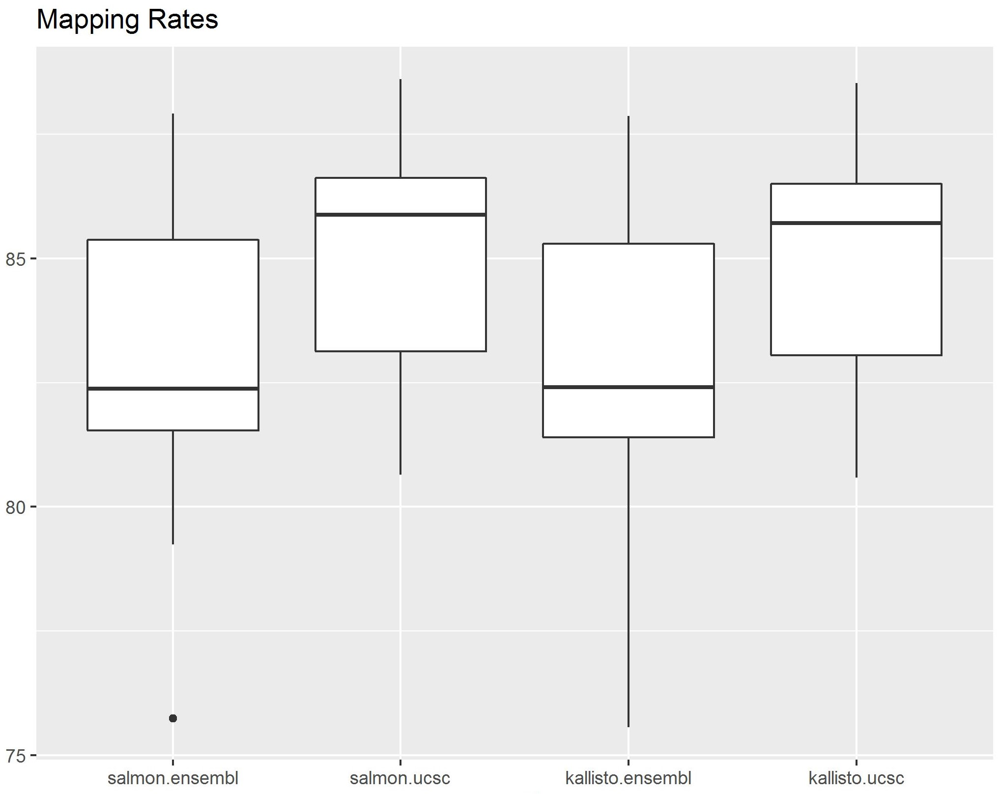

```{r}
library(knitr)
library(ggplot2)
library(tools)
source("util_align.R")
source("util_de.R")
```


#Introduction

To run all the simulations in this notebook, set runSimulation=TRUE
To run the entire pipeline, set runPipeline=TRUE
```{r}
runSimulation=FALSE
runPipeline=FALSE
```

#Run the pipeline
This section automatically generates lists of differentially expressed genes after specifying [user inputs](#userInput_pipeline). For the interpretation and validation of DE, see [this section](#afterDE)
Before running the code, [check the installation of required packages](#runPipeline_package) and add the path of each package to environment.
If using Windows, Cygwin or Linux Subsystem for Windows 10 is required for the shell scripts (called by system function).
Salmon is not supported on Windows, as of version 1.2.0

##Required packages {#runPipeline_package}
The versions used while constructing this pipeline is listed in parentheses  
FastQC(v0.11.8): http://www.bioinformatics.babraham.ac.uk/projects/fastqc/
Salmon(0.8.2):https://salmon.readthedocs.io/en/latest/index.html [@patro_salmon_2017]
R packages:

- limma 3.32.10 [@ritchie_limma_2015]
- biomaRt 2.32.1


##Pipeline
###User Input {#userInput_pipeline}
Specify the following parameters before running the pipeline
```{r, eval=runPipeline}
outDir="Path to output directory"

## fastq files ##
dataDir_fq=c("vector of paths to directories containing all fastq files") #if there are multiple directories, each will be considered as a batch; the directory names will be used as batch name
fastq_extension=c('fastq','fq','fastq.gz','fq.gz')  #add fastq file extension if not already listed

## pseudo-alignment with salmon ##
salmon_index=NA #if using pre-computed index, replace NA with path
reference_fa=NA #if not using pre-computed index, replace NA with path to the fasta of reference transcriptome
reftxpt='ensembl' #name of reference
paired_end=TRUE #if library is paired-end
if(paired_end){
  #option 1: provide the min number of starting characters to identify a library pair, e.g. 9 for library01_left.fq, library01_right.fq, library02_left.fq, library01_right.fq
  libID_len=NA #int or vector of length len(dataDir_fq)
  #option 2: enter full path to all library pairs as shown
  libPairs=list(c('path to library 1 left reads','path to library 1 right reads'),c('library 2 left reads','library 2 right reads'))
}

## DE ##
condition<-list(covariate1=c("condition1_1","condition1_2"),covariate2=c("condition2_1","condition2_2")) #list the experimental conditions; e.g. list(sex=c('female',"male"),treatment=c("high","low"))
refcondition<-list(c("covariateName","conditionName"),c("covariateName","conditionName")) #condition with respect to which DE of other samples is calculated
### example of loading transcript to gene matrx from ensembl using biomaRt; alternatively you can provide a matrix with the first column (target_id) containing transcript id and second column (ens_gene) containing gene id; this step aggregates transcription-level alignment to gene-level counts ###
ensembl <- useMart("ENSEMBL_MART_ENSEMBL",dataset="mmusculus_gene_ensembl")
ttg<-biomaRt::getBM(attributes = c("ensembl_transcript_id","ensembl_gene_id"),mart = ensembl)
ttg <- dplyr::rename(ttg, target_id = ensembl_transcript_id,ens_gene = ensembl_gene_id)

```

Optional adjustments to default parameters
```{r,eval=runPipeline}
alignmethod<-"salmon" #name of the aligner

## salmon ##
kmer_length=31
libType='A'

## DE ##
lowcountfilter=TRUE #if filter out low-count genes by CPM threshold
threshCPM_byAvgColSum=1.5/10e6 #genes passing filter have averages of replicates > avgColsum*threshCPM_byAvgColSum; avgColSum = average of sums of counts of all samples; genes passing filter for each batch are calculated separately
maxNDEG<-'all' #maximum number of genes in the output matrix
FDR<-1 #maximum false discovery rate above which genes will not be included in output
multipletesting_method<-'BH' #method to adjust for multiple testing; choose from "none", "BH", "BY" and "holm"
### optionally provide/construct id2symbol matrix to convert gene ID to symbol, e.g. ensembl ID to MGI symbol
id2symbol=NA #option 1: 2-column matrix - "id" column contains gene ID; "symbol" column contains gene symbols to be converted to; each row specifies conversion for one gene; duplication of id is allowed
convID=NA #option 2: build id2symbol from biomaRt, input format c(id='name of gene ID for biomaRt attribute',symbol='name of gene symbol for biomaRt attribute'), e.g. c(id="ensembl_gene_id",symbol="mgi_symbol")

```

Initializing analysis...
```{r, eval=runPipeline}
## checking output directory ##
if(!dir.exists(outDir)){dir.create(outDir)}

batches<-c()
for(fqi in dataDir_fq){
  fqi_name=basename(fqi)
  batches<-c(batches,fqi_name)
}
contrasts<-condition[-which(condition %in% c(refcondition))] #TODO: modify this to generate a list with length=length(refcondition)

```


###QC with fastQC
```{r, eval=(FALSE | runPipeline)}
for(fqi in dataDir_fq){
  fqi_name=basename(fqi)
  fastqc_out=file.path(outDir,"fastQC_results",fqi_name)
  dir.create(fastqc_out)
  
  for(fq in list_files_with_exts(fqi,fastq_extension,recursive=TRUE,full.names = TRUE)){
    system(paste0("fastqc -f fastq ",fq," --extract ","--outdir=",fastqc_out))
  }
}
```

###Pseudo-alignment with salmon
```{r, eval=(FALSE | runPipeline)}

setwd(outDir)
if(is.na(salmon_index)){
  system(paste0("salmon index -t ",reference_fa," -i transcripts_index_salmon --type quasi -k 31"))
  salmon_index="transcripts_index_salmon"
}

if(!paired_end){
  for(fqi in dataDir_fq){
    fqi_name=basename(fqi)
    salmon_out=file.path(outDir,paste0("salmon",reftxpt,fqi_name))
    dir.create(salmon_out)
    for(fq in list_files_with_exts(fqi,fastq_extension,recursive=TRUE,full.names = TRUE)){
      salmon_out_i=file.path(salmon_out,file_path_sans_ext(basename(fq)))
      dir.create(salmon_out_i)
      system(paste0("salmon quant -i ",salmon_index," -l ",libType," -1 ",fq," -o ",salmon_out_i))
    }
  }
}else{
  if(!is.na(libID_len)){
    getLibPairs(libID_len,dataDir_fq) #TODO: implement getLibPairs in util_align
  }
  for(fqpair in libPairs){
    fqpair_name=basename(dirname(fqpair[[1]]))
    salmon_out=file.path(outDir,paste0("salmon",reftxpt,fqpair_name))
    if(!dir.exists(salmon_out)){dir.create(salmon_out)}
    salmon_out_i=file.path(salmon_out,file_path_sans_ext(basename(fqpair[[1]])))
    dir.create(salmon_out_i)
    system(paste0("salmon quant -i ",salmon_index," -l ",libType," -1 ",fqpair[[1]]," -2 ",fqpair[[2]]," -o ",salmon_out_i))
  }
}

```

###Differential expression analysis
```{r,eval=(FALSE | runPipeline)}

#TODO: modify util_de.R, include multiple covariates & refcondition


sourcedir<-outDir
setwd(sourcedir)

##get counts
countsdf<-countdf(alignmethod,reftxpt,batches,condition)

##low count filtering##
if(lowcountfilter==TRUE){
  countsdfCPM<-filterCPM(countsdf,threshCPM_byAvgColSum)
}

savepath<-file.path(outDir,'de')
if(!dir.exists(savepath)){dir.create(savepath)}

for(c in contrasts){
  deresults<-de(countsdfCPM_photo2_no20mW,c,multipletesting_method,nDEG = maxNDEG,FDR = FDR)
  
  # drawvenn(deresults,"/Users/Xinyi/rna-seq/data/n2a_prelim/de/venn_de",refcondition,c)
  genelist(deresults,savepath,paste0(c),id2symb=id2symbol,convID=convID)
}

```

#Benchmark of pipelne & alternative choicees
##(Pseudo-)alignment and Quantification

The first step in the analysis is usually to transform the fastq files into gene expression matrices. This involves aligning reads to reference genome or reference transcriptome and quantification of aligned reads. Here's a list of choices to consider:

- choice of reference
    * The choice of reference transcriptomes has pronounced influence on gene quantifications due to reasons such as different gene definitions [@zhao_comprehensive_nodate]. See [our demonstration of the difference in DE results due to choice of references ](#ref_align_deagreement).
    * alignment to genome vs transcriptome

- choice of alignment/pseudo-alignment method

###simulation and benchmark
We used Polyester [@frazee_polyester_2015] to simulate RNAseq libraries where a user generated fold-change matrix is used as the ground truth. This simulation is based on mouse mRNA reference transcriptome from UCSC (simAlign/reftxmrna_ucsc_refgene.fasta.gz, assembly GRCm38/mm10, UCSC RefSeq (refGene) table [@karolchik_ucsc_2004]).

To use our simulated data, please refer to simAlign/simfasta1, simAlign/simfasta2, simAlign/simfasta3

To use our framework directly, please refer to the code below and replace parameter values as needed (set eval or runSimulation to TRUE before running).

####Run simulation
Required packages:
- Polyester [@frazee_polyester_2015]
- seqinr
- Biostrings
```{r, eval=(FALSE | runSimulation)}
refPath<-"reftx/reftxmrna_ucsc_refgene.fasta.gz" #path to reference transcriptome
ngroup<-2 #number of conditions in the library
ndata<-3 #number of replicates in each condition
deprob<-0.15 #probability of differential expression
demean<-2 #mean of fold change for DE genes
savepath_fcmtx='simfcmtx' #directory to save fold change matrix
savepath_lib="simfasta" #directory to save simulated libraries
simulateLib_polyester(refPath,ngroup,ndata,deprob,savepath_fcmtx,savepath_lib)
```

####Comparisons of mapping rates
Mapping rates between Salmon and kallisto (0.43.1) are comparible when using ensemble and UCSC as the references.Mapping rates can be found as outputs of Salmon and Kallisto

{ width=70% }

####Comparisons of quantification errors

percent error of transcript X = abs(estimated transcript count of X - actual count of X)/actual count of X * 100
{ width=70% }

####Impacts of reference and (pseudo-)alignment methods on downstream DE analysis {#ref_align_deagreement}
We compared the impacts on two DE algorithms: DEseq2 and limma-voom. To reproduce our results, run deAgreement.R (results will be stored in simAlign/results/deagreement and simAlign/results/deagreement_commonGene). This detects DE between two time points in our alpha-syn experiment (T2 and T7).

Two examples using DEseq2 and voom are shown below.

{ width=70% }
{ width=70% }

There are genes not shared by all combinations of reference and alignment method. So we also plotted the Venn diagrams with the same DE analysis results but only included genes shared by all combinations of {salmon,kallisto}x{ensembl, UCSC refSeq}. 

{ width=70% }

{ width=70% }


##Normalization and DE analysis
Statistical inferences of differential gene expression (DE), including the normalization procedures, usually make assumptions about typical datasets' characteristics, such as gene-count distribution and degree of DE [@seyednasrollah_comparison_2015, @dillies_comprehensive_2013, @dillies_comprehensive_2013]. It is important to understand how robust each normalization or DGE analysis method is when its assumptions are violated.

To test the performance given datasets with distinct features, we simulated 

- 23 datasets with 11 varying parameters
- 11 empirically simulated datasets with 5 varying parameters

{ width=70% }

All simulations used Splatter [@zappia_splatter:_2017] with dropout rate equals to zero. Fixed parameters of the empirical simulations were derived from a dataset by Bottomly et al [@bottomly_evaluating_2011]. 

###Simulation results
We tested the following combinations of normalization and DE analysis methods:

- edgeR with
    - TPM
    - FPKM
    - *Trimmed Mean of M-values (TMM), default normalization of edgeR*
    - Relative Log Expression (RLE)
    - Upper Quartile (UQ)
    - RUVg + TMM
    - RUVg (remove unwanted variation) + RLE
    - RUVg + UQ
    - DEGES (DEG elimination strategy) + TMM
    - DEGES + RLE, DEGES + TbT
    
- DEGES with
    - DESeq2
    - baySeq
    - edgeR
    - limma-voom 
    
- baySeq, DESeq2, and limma-voom with their default normalization methods

The benchmark results can be found in testdata/normtestresults and testdata/DEtestresults  
The simulated datasets can be found in testdata/simulatedData  
To reproduce our results, see the [next section](#de_simtest)  

Choice of normalization methods had very small impact on the benchmarking results. The ROC, accuracy vs FDR, and FDR control curves are comparable for all normalizations. An example is shown for ROC

{ width=70% }

Choice of DE analysis methods has trade-off between true positive rates and false discovery rates

{ width=70% }

{ width=70% }

###Run simulation & benchmark {#de_simtest}
Requires:
- splatter 1.0.3 [@zappia_splatter:_2017]

```{r, eval=(FALSE | runSimulation)}
## enter the parameter values you want to test ##
groupCells<-c(3,9,6)
mean.shape<-c(0.4,0.8,0.6)
mean.rate<-c(0.1,0.5,0.3)
lib.loc<- c(6,16,11)
lib.scale<-c(0.15,0.5,0.35)
out.prob<-c(0.01,0.1,0.05)
de.prob<-c(0.05,0.3,0.1)
de.downProb<-c(0.25,0.75,0.5)
de.facLoc<-c(0.05,0.3,0.1)
de.facScale<-c(0.2,0.6,0.4)
bcv.common<-c(0.05,0.2,0.1)

generateSimulatedCounts(normalizationMethod,deMethod,groupCells,mean.shape,mean.rate,lib.loc,lib.scale,out.prob,de.prob,de.downProb,de.facLoc,bcv.common)
```


#Interpretation and validation of differential expression analysis {#afterDE}
##False positives
We performed RNA-seq twice on a total of 6 samples of mouse Neuro2A cell cultures (3 samples for each RNA-seq). The same protocols were used and all libraries have comparable quality. We found 2665 differentially expressed genes with FDR < 0.05 using the default settings of this pipeline. With the limited number of replicates available in a typical RNA-seq experiment, it is important to consider confounding differences caused by experimental design and handling. In the following sections, we provide some methods for validation and interpretation of DE genes.

##Functional enrichment analysis
###Statistical over-representation test
This tests for any over or under represented annotation terms in the query list with respect to the background. Several options are listed below:  

* DAVID [@huang_systematic_2009]: https://david.ncifcrf.gov/
    - Only over-representations are calculated  
    - Last knowledge base update was in May 2016  
    - DAVID has access to multiple databases  
  
* PANTHER [@mi_protocol_2019]: http://pantherdb.org/  
    - Both over and under representations are calculated  
    - Maintained up to date with Gene Ontology annotations  
  
####Choosing background gene list
Some common choices of background include genes known to be expressed in a particular cell type of interest. A proxy for cell-type specific background can be found by using all non-zero genes:
```{r,eval=FALSE}
countsmtx<-as.matrix(as.data.frame(countsdf))
background<-rownames(countsmtx)[which(rowSums(countsmtx) > 0)]
```
However, it is possible that this list does not cover all genes that can be expressed due to the limited experimental conditions tested.

###GSEA
###WGCNA
###ADAGE

##Dimensionality reduction

##Enrichment of transcription factors

##Batch consensus

# References
